KeyCloak
=============

Example OIDC configuration with Keycloak provider

## 0. Pull, extract and install the Keycloak helm chart
```
helm repo add bitnami https://charts.bitnami.com/bitnami
helm repo update
helm pull bitnami/keycloak
tar -xzvf keycloak-*.tgz
cd keycloak/
```
Keycloak is first deployed with one admin user that we need to configure before deployment, to do so we need to pass the username/password in the `values.yaml` file like follows:

```
auth:
  adminUser: admin
  adminPassword: password
```
Launching installation


```
helm dep up
helm install my-release bitnami/keycloak
```
## 1. Configure keycloak

<a href="https://www.keycloak.org/" alt="Keycloak"> </a>

> "Keycloak is an open source Identity and Access Management solution aimed at modern applications and services. It makes it easy to secure applications and services with little to no code."

Once deployed we can access the user interface and log in: 

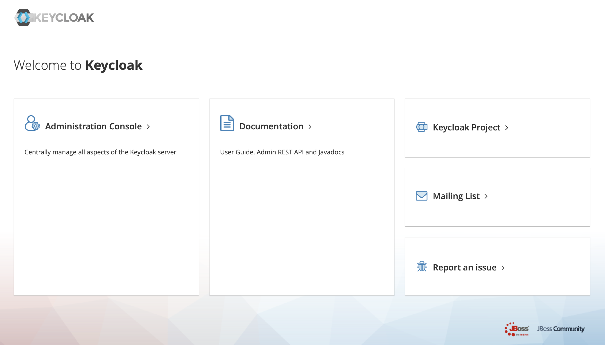

We click on **administration console** then we log in using the credentials we configured above.

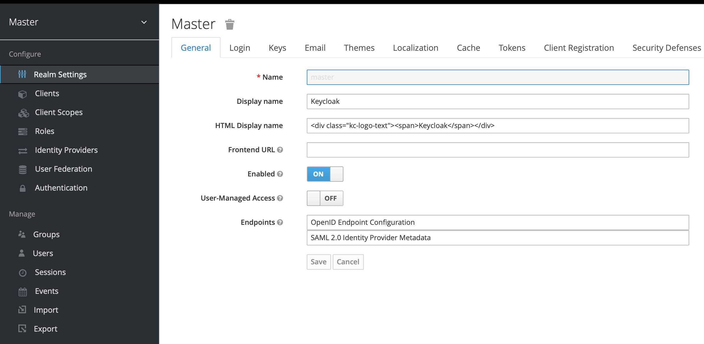

## Create realm

When you log in to the admin console, you work in a realm, which is a space where you manage objects. Two types of realms exist:

* **Master realm** - This realm was created for you when you first started Keycloak. It contains the admin account you created at the first login. You use this realm only to create other realms.

* **Other realms** - These realms are created by the admin in the master realm. In these realms, administrators create users and applications. The applications are owned by the users.

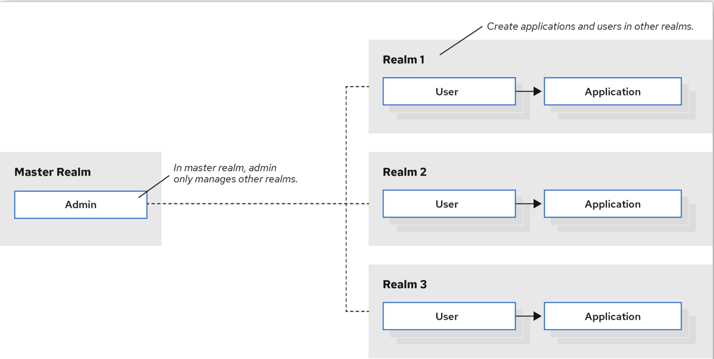

To create a realm, head to the Master menu, click `Add Realm`. When you are logged in to the master realm, this menu lists all other realms, then type for example `devops` in the Name field to name our new realm devops.

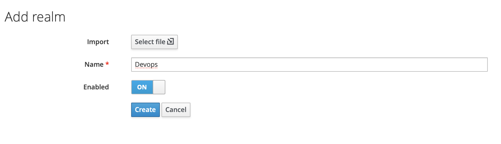

When we click `Create`, the main admin console page opens with realm set to devops, now we can switch between managing the master realm and the realm we just created by clicking entries in the `Select realm` drop-down list.

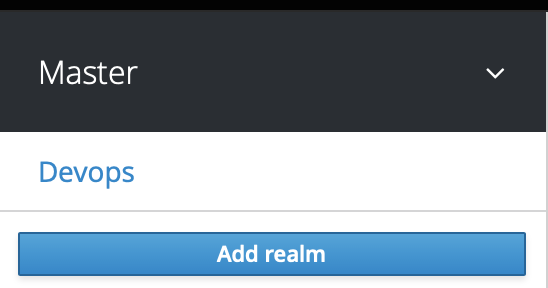


## Create Nifi client

To create clients we first click **Clients** in the **left side menu** to open the Clients page.

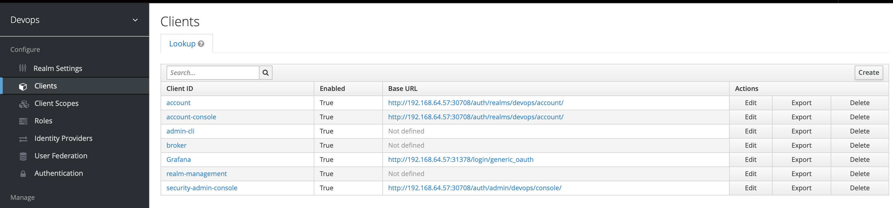

On the right side, we click `Create` and then on the `Add Client` dialog, we create a client called `Nifi` by filling the fields as follows:

* Client ID: `Nifi`
* Root URL: `\<your-Nifi-address>`, for this example our Nifi adress is https://localhost:8443 (don't forget the "s" of "https")

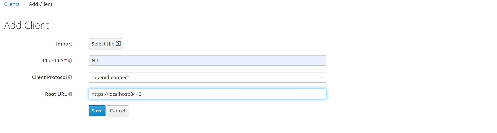

Once the client is created, we open the client configuration and change the **access type** to **confidential** from public, and complete the rest of the fields as shown below assuming our Nifi address is https://localhost:8443, then we **Save the config**.


Now we open the client Nifi again, go to **credentials tag** and copy the `client id` and `secret` because we are going to need them to configure Nifi later.


## Create user


In the devops realm, we need to create a new user and a temporary password for that new user, we head to the left menu, click Users to open the user list page.

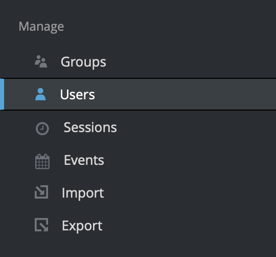


On the right side of the empty user list, click Add User to open the Add user page.

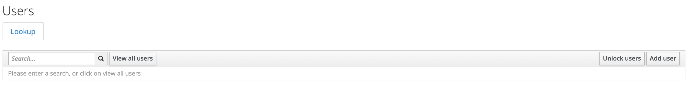


we enter a name in the Username field (this is the only required field), then we flip the Email Verified switch to On and click Save.

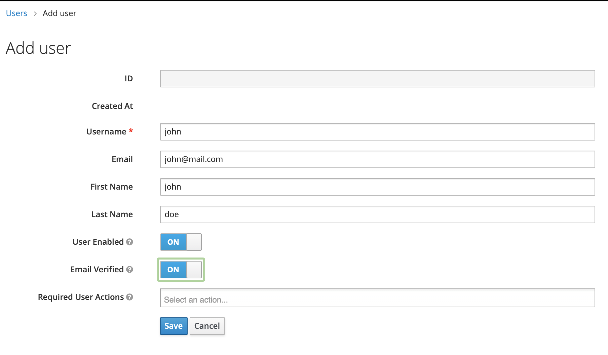


The management page for the new user opens, we Click the **Credentials tab** to set a temporary password for the new user, we type a new password and confirm it.

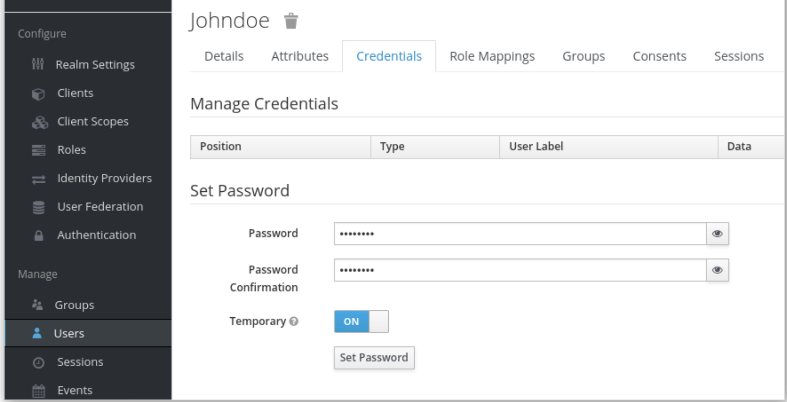


then we Click **Set Password** to set the user password to the new one we specified.

